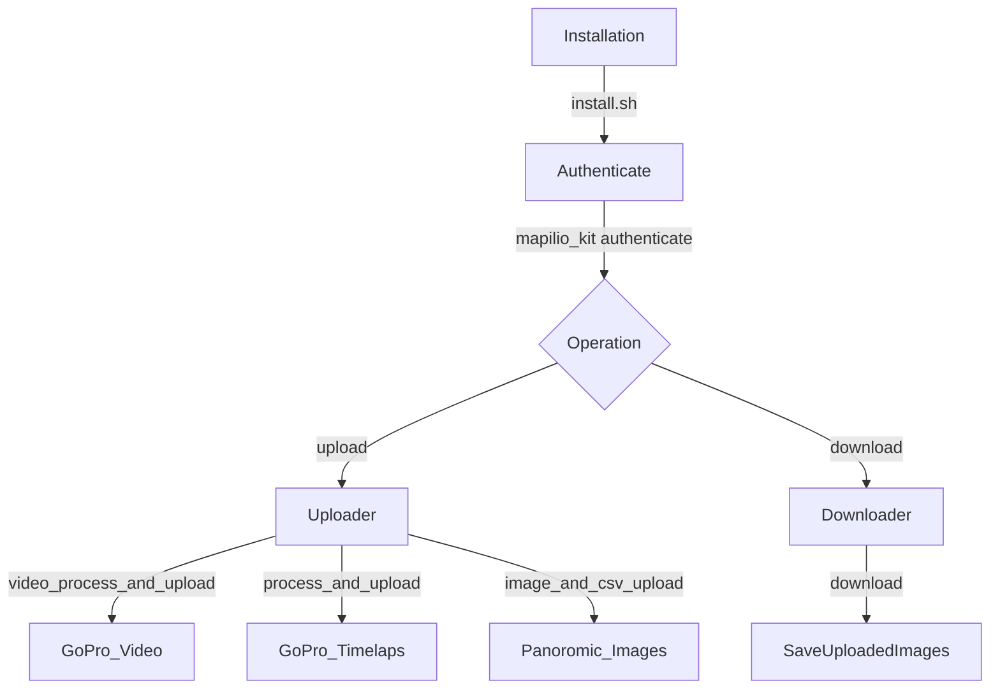

## Mapilio Kit

Mapilio Kit is a library for processing and uploading images to [Mapilio](https://www.mapilio.com/).



<!--ts-->

* [Quickstart](#quickstart)
* [Requirements](#requirements)
* [Installation](#installation)
* [Video Support](#video-support)
* [Usage](#usage)
    - [Authenticate](#authenticate)
    - [Process](#process)
    - [Upload](#upload)
    - [Video Process](#video-process)
* [Download](#download)
* [Advanced Usage](#advanced-usage)
    - [Image Description](#image-description)

<!--te-->	

## Quickstart

Download the latest `mapilio_kit` binaries for your platform
here: https://github.com/mapilio/mapilio-kit/releases/tag/v1.4.1

See [more installation instructions](#installation) below.

## Requirements

### User Authentication

To upload images to Mapilio, an account is required and can be created [here](https://www.mapilio.com/signup). When
using the kits for the first time, user authentication is required. You will be prompted to enter your account
credentials.

### Metadata

To upload images to Mapilio, image `GPS` and `capture time` are minimally required.

## Ubuntu Installation

### Installing via Pip on Ubuntu + 18.04

Python (3.6 and above) and git are required:

```shell
git clone https://github.com/mapilio/mapilio-kit.git
cd mapilio-kit
chmod +x install.sh
source ./install.sh

pip install -r requirements.txt 
```

or

```bash
python3 -m pip install --upgrade git+https://github.com/mapilio/mapilio-kit
```

If you see "Permission Denied" error, try to run the command above with `sudo`

### Docker Installation Process and Upload

First, update your ".env" file your login and upload information.

```text
DATASET_PATH="/home/dir"
USER_NAME="test@mapilio.com"
USER_EMAIL="test@mapilio.com"
USER_PASSWORD="********"
```
 
```shell
sudo docker-compose up -d
sudo docker run -it mapilio-kit_app:latest bash
```

#### Timelaps Images upload
```bash
mapilio_kit process_and_upload datasets/101GOPRO --user_name="username@mapilio.com"
```

#### Video Images upload
```bash
mapilio_kit video_process_and_upload "datasets/101GOPRO" "/home/101GOPRO_imgs" \
    --geotag_source "gopro_videos" \
    --interpolate_directions \
    --video_sample_interval 1
    
mapilio_kit process_and_upload /home/101GOPRO_imgs --user_name="username@mapilio.com"
```

#### 360 Max Process and upload
```bash
mapilio_kit gopro360max_process --video-file datasets/GS017111.360 --output-folder /home/GS017111_video --bin-dir /mapilio_kit/bin/
    
mapilio_kit process_and_upload /home/GS017111_video --user_name="username@mapilio.com"
```


## Video Support

To [process videos](#video-process), you will also need to install `ffmpeg` and `exiftool`.

You can download `ffmpeg` from [here](https://ffmpeg.org/download.html). Make sure it is executable and put the
downloaded binaries in your `$PATH`. You can also install `ffmpeg` with your favourite package manager. For example:

On **Windows**: follower the [ffmeg](https://www.wikihow.com/Install-FFmpeg-on-Windows) and [exiftool](https://exiftool.org/install.html#Windows)

On **macOS**, use [Homebrew](https://brew.sh/):

```shell
brew install ffmpeg
brew install exiftool
```

On **Debian/Ubuntu**:

```shell
sudo apt install ffmpeg
sudo apt install exiftool
```

On **Windows**:
Open the powershell.exe 
```shell
Set-ExecutionPolicy Bypass -Scope Process -Force; [System.Net.ServicePointManager]::SecurityProtocol = [System.Net.ServicePointManager]::SecurityProtocol -bor 3072; iex ((New-Object System.Net.WebClient).DownloadString('https://community.chocolatey.org/install.ps1'))
choco install ffmpeg
choco install exiftool
```

## Usage

### User Authentication

To upload images to **Mapilio**, an account is required and can be created [here](https://www.mapilio.com/). When
using the tools for the first time, user authentication is required. You will be prompted to enter your account
credentials.

### Authenticate

The command `authenticate` will update the user credentials stored in the config file.

#### Examples

Authenticate new user:

```shell
mapilio_kit authenticate
```

Authenticate for user `user_name`. If the user is already authenticated, it will update the credentials in the config:

```shell
mapilio_kit authenticate --user_name "mapilio_user_mail"
```

## Video Support Devices

For now, We have supporting that devices :

| GoPro Hero 9 | GoPro Hero 8 | GoPro Hero 7 | GoPro Max | Ladybug | Insta360|
|--------------|--------------|--------------|--------------| -----|-----|

## Usage

| Authenticate | Video Process  | Process  | Upload | Download  |
|--------------|----------------|---------|---------------|-----------|

### Process Images

#### Images in Exif (MetaData)

The `process` command **geotags** images in the given directory. It extracts the required and optional metadata from
image EXIF (or the other supported geotag sources), and writes all the metadata (or process errors) in
an [image description](#image-description) file, which will be read during [upload](#upload).

**Required MetaData**

| GPS | CaptureTime |
|--------------|--------------|

#### Examples

Process all images in the directory `path/to/images/` (and its sub-directories):

```shell
mapilio_kit process "path/to/images/"
```

#### From .gpx

Interpolate images in the directory `path/to/images/` on the GPX track read from `path/to/gpx_file.gpx`. The images are
required to contain capture time in order to sort the images and interpolate them.

```shell
mapilio_kit process_and_upload "path/to/images/" \
    --geotag_source "gpx" \
    --geotag_source_path "path/to/gpx_file.gpx"
```

### Upload Images

Images that have been successfully processed can be uploaded with the `upload` command.

#### Examples

Upload all processed images in the directory `path/to/images/` to user `mly_user` for organization `mly_organization_id`
. It is optional to specify `--user_name` if you have only one user [authenticated](#authenticate).

```shell
mapilio_kit upload "path/to/images/" \
    --user_name "mapilio_user_mail" \
    --organization_key "mapilio_organization_id" \
    --project_key "mapilio_project_id"
```

#### 360 panorama image upload command

Check the CSV format [panoramic image description schema](https://github.com/mapilio/mapilio-uploader/tree/master/schema/panoromic_image_description_shecma.csv)

```shell
mapilio_kit image_and_csv_upload "path/to/images" --csv_path "path/to/test.csv" --user_name "example@mapilio.com"
```

### Mapilio tools to Video Process and Upload

Video process involves two commands:

1. `sample_video`: sample videos into images, and insert capture times to the image EXIF. Capture time is calculated
   based on the video start time and sampling interval. This is where `ffmpeg` is being used.
2. `process`: process (geotag) the sample images with the specified source

The two commands are usually combined into a single command `video_process_and_upload`. See the examples below.

#### Examples

## GoPro Hero 9-8-7 Black and 360

**GoPro .mp4 videos**

1. Sample GoPro videos in directory `path/to/videos/` into import path *(must be created before
   starting*)`path/to/sample_images/` at a sampling rate 1 seconds, i.e. two frames every second, reading geotag data
   from the GoPro videos in `path/to/videos/`.

```shell
mapilio_kit video_process_and_upload "path/to/videos/" "path/to/sample_images/" \
    --geotag_source "gopro_videos" \
    --interpolate_directions \
    --video_sample_interval 1
```

2. Checking `path/to/sample_images/` images and `mapilio_image_description.json` then run under command

```shell
mapilio_kit upload "path/to/sample_images/" --desc_path "mapilio_image_description.json"
```

## **GoPro Max .360 videos**

### Must be installed `./max_extractor_install.sh` with method

1. First, create equirectangular convert script such as below 

python script config
- -vf {video file path}
- -of {output frames path}
- -b {equirectanguler bin path}
```shell
cd mapilio_kit
python commands/gps_from_gopro360.py -vf ~/Desktop/GS017111.360 -of ~/Desktop/OutputData -b ../../bin
```

2. Now we can process and upload frames


```shell
mapilio_kit process_and_upload ~/Desktop/OutputData/frames --user_name="username@mapilio.com" 

```
[OPTIONAL]

This datas random unique numbers such as "_wAuFDewU51tll27dfzdMQM28_"

- --organization_key="mapilio.com/username/organtion" 
- --project_key="mapilio.com/username/projects"

### Docker Upload

**TODO docker-composer.yml**

If up docker container follow instructors

```bash
docker run -it mapilio_kit bash
mapilio_kit gopro360max_process --video-file datasets/GS017111.360 --bin-dir /mapilio_kit/bin
mapilio_kit process_and_upload /tmp/frames --user_name="username@mapilio.com" 
```

then check in container

```bash
ls /tmp/test
```


## Download

If you download your uploaded project to your organization use this command.

```bash
export o_key="wAuFDewU51tll27dfzdMQM28"
export p_key="9EwBC9TrbF"
mapilio_kit download  "/path/to/download/directory" --organization_key=$o_key --project_key=$p_key --user_name "exmaple@mapilio.com"
```

- After run script select image quality
    - [ ] 240
    - [ ] 480
    - [ ] 1080
- Check the `/path/to/download/directory/MAPILIO/o_key/p_key/[sequence_uuid]`

## Advanced Usage

### Image Description

As the output, the `procss` command generates `mapilio_image_description.json` under the image directory by default. The
file contains an array of objects, each of which records the metadata of one image in the image directory. The metadata
is validated by [the image description schema](https://github.com/mapilio/mapilio-uploader/tree/master/schema)
